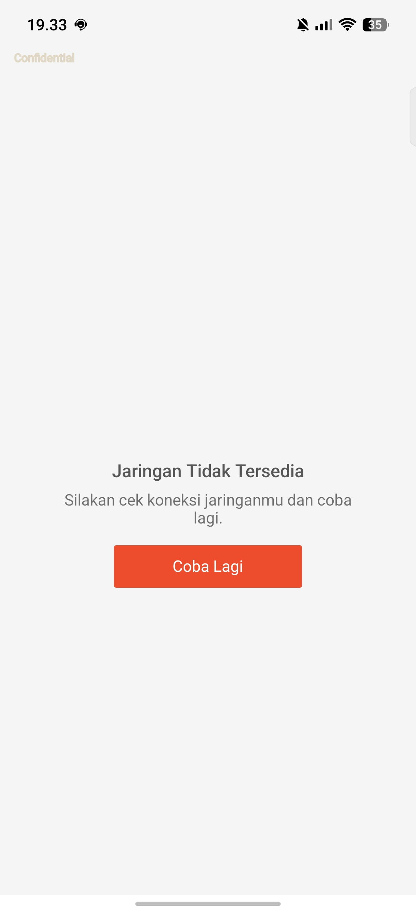
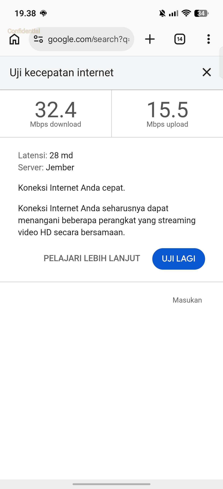

# CASE-012: Shopee WiFi — 应用层弱网误报（系统 WiFi 正常，测速佐证）

## 基本信息
- **案例ID**: CASE-012
- **分类**: disconnect
- **来源**: TOS163-35222
- **创建时间**: 2026-06-08
- **匹配次数**: 0

## 现象描述
- 印尼粉丝使用 WiFi 打开 Shopee 购物时反复提示「jaringan tidak tersedia」（网络不可用），换蜂窝数据正常
- 机型 TECNO LK7，Android 16 / HiOS 16.3.0（LK7-16.3.0.120SP03 FANS），MTK 平台
- 应用 Shopee（com.shopee.id），React Native + Cronet + `libshp_weaknetwork.so`
- 高概率；同一会话内 **两张截图构成对比证据**：
  - **事件 A（截图1，19:33:23）**：状态栏 WiFi 满格，系统 Ping/Probe 正常，kernel PER **0~3%**，但 Shopee 显示网络不可用
  - **事件 B（截图2，19:38:33）**：用户 Google 测速 **32.4/15.5 Mbps**、延迟 **28 ms**，系统判定「网络很快」，与 Shopee 报错矛盾

### 用户截图

<div style="display:flex; gap:20px; flex-wrap:wrap; align-items:flex-start;">
  <div style="max-width:280px;">
    <p><strong>截图1（19:33:23）</strong><br/>Shopee 报「Jaringan Tidak Tersedia」，状态栏 WiFi 满格</p>
    
  </div>
  <div style="max-width:280px;">
    <p><strong>截图2（19:38:33）</strong><br/>Google 测速正常，WiFi 32.4/15.5 Mbps</p>
    
  </div>
</div>

## 根因结论

### 主因：Shopee 应用层误报（事件 A，19:33:23）
**Shopee 业务层/弱网库判定网络不可用，与系统 Connectivity 状态不一致。**

机理：
1. 19:33:23 前后 RSSI **-31~-37 dBm**，Ping **4–5 ms**，Probe 204 成功，**无** `network lost`
2. kernel `wlanLinkQualityMonitor`：19:33:18 **PER=3%**，19:33:24 **PER=0%**，Tx **780 Mbps**；截图时刻空口质量正常
3. 19:33 分钟内存在偶发 PER 突刺（max 100%），但**不落在截图时刻**；不符合 CASE-008 类持续高 PER/空口拥塞
4. 错误页自 **19:30:00** 起已存在，用户反复点「Coba Lagi」触发 `SBE: this page is abnormal implementation`
5. main log 未见 Shopee Cronet/HTTP 明确失败（可能仅在 marsxlog）；需应用侧日志或 tcpdump 坐实 API 失败原因

### 辅证：系统 WiFi 实测正常（事件 B，19:38:33）
**用户在 Chrome/Google 测速验证 WiFi 可用，说明问题具有应用选择性。**

- 截图2 时刻 Log2 已结束（main 19:36:27、kernel 19:34:01），**无 19:38:33 PER 直采**
- kernel 末条采样 19:34:01 **PER=5%**，与后续测速 32.4 Mbps 不矛盾
- 推断用户在 19:36–19:38 间恢复了 WiFi 连接

### 背景事件（附录，非截图对齐）：19:34:04 框架断连
**传音 `WifiNetworkQuality` 在 `isHighPingDelay=true` 时触发全频扫描，扫描失败（status=-9）后 tear down `wlan0`。**

- 发生在截图1 之后、截图2 之前，Jira 申报 19:34:20 可能对应此时段
- 用户两张截图均未捕捉该时刻；**不作为主分析时间点**
- 机理链：`isHighPingDelay` → `start scan` → `status: -9` → `torn down wlan0` → `network lost`

## 排查步骤

### 鉴别事件 A vs 系统真断连（首要）
1. 对齐截图时间与 main_log / kernel `.localtime`
2. **事件 A（应用层误报）**：有 `SBE: this page is abnormal implementation`，**无** `network lost` / `torn down wlan0`，且 `WifiNetworkCheck` Ping/Probe 成功；kernel PER 截图时刻 **≤3%**
3. **框架真断连**：存在完整链 `isHighPingDelay` → `start scan` → `status: -9` → `torn down wlan0` → `Wifi network lost`

### 事件 A 深挖
1. 搜 `com.shopee.id` + `SBE` / `weaknetwork` / Cronet 错误
2. 对照系统 `WifiNetworkCheck` Ping/Probe 与 Shopee 错误页出现时间
3. kernel `wlanLinkQualityMonitor` 对齐截图时刻 PER（约 1s 采样间隔）
4. 若有 marsxlog/tcpdump，对齐 Shopee API 域名请求成败

### 事件 B 佐证
1. 用户是否通过测速/浏览器验证系统网络（排除「仅 Shopee 异常」）
2. 注意日志截止时刻与截图时间的空白期

## 关键日志

```
// 事件 A：19:33:23 — WiFi 正常，Shopee 应用层报错
06-06 19:33:08.300406  WifiStatistics:WifiNetworkCheck: Ping result: {success=true, time=4ms}
06-06 19:33:14.359925  21320 30421 E SBE: this page is abnormal implementation
06-06 19:33:22.703960  TranWifiSmartAssistantController: ====>>rssi :-31
06-06 19:33:28.458119  WifiStatistics:WifiNetworkCheck: Ping result: {success=true, time=5ms}

// 事件 A：PER（kernel wlanLinkQualityMonitor，Asia/Jakarta）
06-06 19:33:18.776  ... Tx(rate:780,...), Rx(rate:722,...), PER(3), ...
06-06 19:33:24.919  ... Tx(rate:780,...), Rx(rate:722,...), PER(0), ...

// 附录：19:34:04 — 框架 tear down wlan0（背景）
06-06 19:34:04.770760  WifiNetworkQuality: isHighPingDelay : true , hasInternetAccess : true
06-06 19:34:04.771014  WifiNetworkQuality: start scan !
06-06 19:34:04.772275  WificondScannerImpl: Failed to start scan, freqs=null status: -9
06-06 19:34:04.851881  WifiNative: Successfully torn down Iface:{Name=wlan0,Id=22,Type=STA_CONNECTIVITY}
06-06 19:34:04.897447  WifiStatistics:WifiNetworkCheck: Wifi network lost
```

## TAG
- SBE abnormal implementation
- libshp_weaknetwork
- Shopee
- 应用层误报
- 强信号
- wlanLinkQualityMonitor
- PER低
- LK7
- 印度尼西亚
- WifiNetworkQuality（背景）
- isHighPingDelay（背景）
- torn down wlan0（背景）

## 建议措施

### 应用侧（优先，事件 A）
1. 向 Shopee 排查业务 API / `libshp_weaknetwork` 与系统网络状态不同步原因
2. 复测抓取 tcpdump + Shopee marsxlog，对齐应用层与系统层
3. 对比 Shopee 在 WiFi vs 蜂窝下的 API 域名/路由差异

### 系统侧（次要，背景事件）
4. `isHighPingDelay=true` 时不应因扫描失败 tear down 当前 STA 连接
5. 分析 `WificondScannerImpl status: -9` 根因；优化断连后快速重连

## 数据局限
- Log1 止于 19:30:11，Log2 main 覆盖 19:24–19:36:27，kernel 止于 19:34:01
- 19:38:33 截图无日志直采；事件 A 缺少 Shopee HTTP 层 main log 明确失败栈

## 相关案例
- **CASE-008（LK7OS163-2102）**：强信号 + PER 间歇突刺导致性能差，但 **WiFi 未断开**；本案截图时刻 PER 极低，主因是应用层误报。鉴别：截图时刻 PER + 有无 `torn down wlan0`
- **CASE-006（LK7OS163-2073）**：弱信号 + 漫游失败，与本单强信号场景相反
